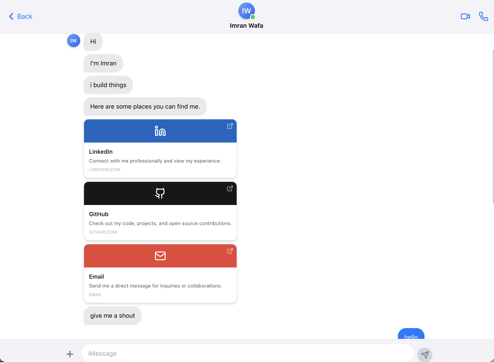

# Imran Wafa - iMessage Portfolio

An interactive, iMessage-style personal portfolio website built with Next.js, TypeScript, and Tailwind CSS. Features animated message sequences, a functional contact form with email delivery, rate limiting, and dark mode support.



## Features

- **iMessage Interface**: Authentic iOS-style chat interface with realistic animations
- **Animated Message Sequence**: Sequential message appearance with typing indicators
- **Interactive Portfolio Links**: Clickable LinkedIn, GitHub, and Email links
- **Contact Form via Chat**: Users can send messages directly through the chat interface
- **Email Delivery**: Backend API with Nodemailer for sending messages to your email
- **Rate Limiting**: Prevents spam (1 message per 30 seconds per IP)
- **Refresh Detection**: Shows "you back?" message on page refresh with restart option
- **Dark Mode Support**: Automatic dark mode based on system preferences
- **SEO Optimized**: Meta tags, Open Graph, Twitter Cards, and structured data
- **Mobile First**: Fully responsive design optimized for mobile devices
- **Accessibility**: Keyboard navigation, screen reader support, reduced motion preferences

## Tech Stack

- **Framework**: [Next.js 15](https://nextjs.org/) with App Router
- **Language**: [TypeScript](https://www.typescriptlang.org/)
- **Styling**: [Tailwind CSS](https://tailwindcss.com/)
- **Animations**: [Framer Motion](https://www.framer.com/motion/)
- **Icons**: [Lucide React](https://lucide.dev/)
- **Email**: [Nodemailer](https://nodemailer.com/)
- **Deployment**: [Vercel](https://vercel.com/) (recommended)

## Getting Started

### Prerequisites

- Node.js 18+ 
- npm or yarn
- SMTP credentials (for email functionality)

### Installation

1. Clone the repository:
```bash
git clone https://github.com/imranwafa/imessage-portfolio.git
cd imessage-portfolio
```

2. Install dependencies:
```bash
npm install
```

3. Create environment variables:
```bash
cp .env.example .env.local
```

4. Edit `.env.local` with your credentials:
```env
SMTP_HOST=smtp.gmail.com
SMTP_PORT=587
SMTP_USER=your-email@gmail.com
SMTP_PASS=your-app-password
RECIPIENT_EMAIL=your-email@gmail.com
```

> **Note**: For Gmail, you'll need to generate an [App Password](https://support.google.com/accounts/answer/185833) instead of your regular password.

5. Run the development server:
```bash
npm run dev
```

6. Open [http://localhost:3000](http://localhost:3000) in your browser.

## Project Structure

```
├── src/
│   ├── app/
│   │   ├── api/
│   │   │   └── contact/
│   │   │       └── route.ts      # API route for contact form
│   │   ├── globals.css           # Global styles
│   │   ├── layout.tsx            # Root layout with SEO meta tags
│   │   └── page.tsx              # Main page
│   ├── components/
│   │   ├── ChatContainer.tsx     # Main chat container
│   │   ├── ChatHeader.tsx        # Chat header component
│   │   ├── InputBar.tsx          # Message input bar
│   │   ├── MessageBubble.tsx     # Message bubble component
│   │   ├── RestartButton.tsx     # Restart button component
│   │   └── TypingIndicator.tsx   # Typing indicator animation
│   └── lib/
│       ├── types.ts              # TypeScript types
│       └── utils.ts              # Utility functions
├── .env.example                  # Example environment variables
├── next.config.ts                # Next.js configuration
├── package.json
├── tailwind.config.ts
└── README.md
```

## Customization

### Update Personal Information

1. **Name and Avatar**: Edit `src/components/ChatHeader.tsx` and `src/components/MessageBubble.tsx`
2. **Intro Messages**: Edit the `INTRO_MESSAGES` array in `src/components/ChatContainer.tsx`
3. **Social Links**: Update the `LINK_MESSAGES` array in `src/components/ChatContainer.tsx`

### Update Links

In `src/components/ChatContainer.tsx`, update the `LINK_MESSAGES` array:

```typescript
const LINK_MESSAGES = [
  {
    text: 'LinkedIn',
    linkData: {
      url: 'https://linkedin.com/in/YOUR_USERNAME',
      icon: 'linkedin' as const,
      label: 'LinkedIn',
    },
  },
  // ... other links
];
```

### Update Colors

The iMessage blue color is defined in `src/app/globals.css`:

```css
:root {
  --imessage-blue: #007AFF;
}
```

## Deployment

### Vercel (Recommended)

1. Push your code to GitHub
2. Import your repository on [Vercel](https://vercel.com/)
3. Add environment variables in Vercel dashboard
4. Deploy!

[](https://vercel.com/new)

### Other Platforms

Build the project:
```bash
npm run build
```

The static files will be in the `dist` directory.

## Environment Variables

| Variable | Description | Required |
|----------|-------------|----------|
| `SMTP_HOST` | SMTP server host | Yes |
| `SMTP_PORT` | SMTP server port | Yes |
| `SMTP_USER` | SMTP username/email | Yes |
| `SMTP_PASS` | SMTP password/app password | Yes |
| `RECIPIENT_EMAIL` | Where to receive messages | Yes |
| `GOOGLE_SITE_VERIFICATION` | Google Search Console verification | No |

## API Routes

### POST /api/contact

Sends a message via email.

**Request Body:**
```json
{
  "message": "Hello!",
  "timestamp": "2024-01-01T00:00:00.000Z"
}
```

**Response:**
```json
{
  "success": true,
  "message": "Message sent successfully",
  "rateLimit": {
    "remaining": 0,
    "resetTime": 1704067200000
  }
}
```

**Rate Limiting:**
- Maximum 1 request per 30 seconds per IP
- Returns `429 Too Many Requests` if limit exceeded

## Browser Support

- Chrome 90+
- Firefox 88+
- Safari 14+
- Edge 90+

## Performance

- Lighthouse Score: 95+ (Performance, Accessibility, Best Practices, SEO)
- First Contentful Paint: < 1s
- Time to Interactive: < 2s

## License

MIT License - feel free to use this template for your own portfolio!

## Credits

- Design inspired by Apple iMessage
- Built with [Next.js](https://nextjs.org/)
- Icons by [Lucide](https://lucide.dev/)
- Animations by [Framer Motion](https://www.framer.com/motion/)

---

Made with ❤️ by [Imran Wafa](https://github.com/imranwafa)
